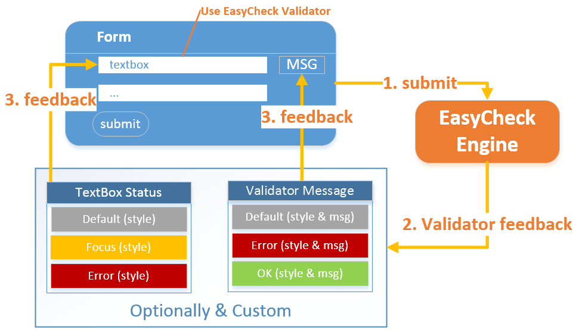
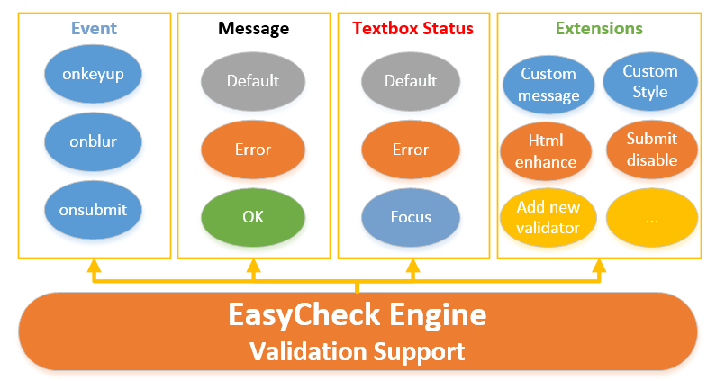
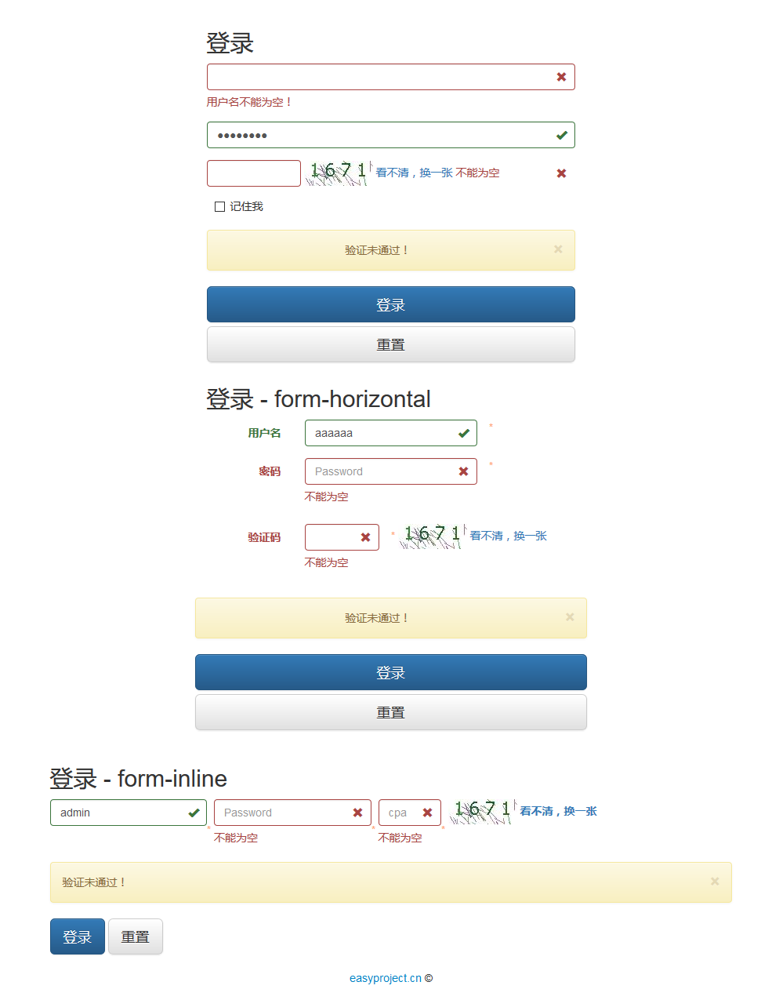

# EasyCheck 验证框架手册

EasyCheck(Echeck)，是一个基于 jQuery 的前端 JavaScript 表单验证框架，无需编程通过 HTML 增强即可完成表单验证工作，简化前端开发工作，并保持统一验证风格，提高效率。并提供灵活的自定义接口，支持基于验证引擎的插件扩展。

最新版本:  `5.1.1-RELEASE`

### [官方主页](http://www.easyproject.cn/easycheck/zh-cn/index.jsp 'EasyCheck官网 HOME 主页')

### [Demo](http://www.easyproject.cn/easycheck/zh-cn/index.jsp#demo 'Demo - 中文]')


## 功能 

**主要特点：**

1. 轻量级

2. 无需 JS 编程

3. 支持基于类、基于属性和组合验证器

4. 内置能满足日常开发的十多种常用验证器

5. 文本框验证样式自动切换

6. 默认、错误和正确三种提示消息内容

7. 提示消息位置的自定义

8. 防客户端重复提交功能

9. 扩展性，支持用户开发注册新验证器
 
10. 引擎框架扩展，支持插件：DIV, ToolTip, Bootstrap3 插件


**兼容性**：
- 浏览器：完全兼容IE6及以上版本、Firefox、Chrome、Safari、Opera等各内核（Trident、Gecko、Webkit、Presto）浏览器，并兼容多平台及系统（PC，TabletPC，Mobile）。 
- jQuery: `1.9+`, `2.X`, `3.X`
> Bootstrap 验证插件的兼容性与 Bootstrap 最低兼容要求一致


**支持插件：**
- DIV
- ToolTip
- Bootstrap3

> 说明：EasyCheck 与 ECheck 插件为同一插件。在早期 ECheck 对应英文版，EasyCheck 对应中文版，在 `4.0.0` 版本后，通过语言文件控制，不再按地区区分下载。  


## 架构 






## 1. 引入验证插件

添加 CSS 和 JavaScript 文件模板： 

 ```HTML
 <!-- EasyCheck start -->
 
 <!-- 验证插件需要的 CSS **如果存在** -->
 <link rel="stylesheet" type="text/css" href="easycheck/plugins/XXX/easycheck-XXX.css"/>  
 
 <!-- jQuery 必须在第一位 -->
 <script type="text/javascript" src="easycheck/jquery-1.12.4.min.js"></script>
 
 <!-- EasyCheck 引擎框架 -->
 <script type="text/javascript" src="easycheck/easy.easycheck-x.y.z.min.js"></script>
 <!-- XXX 插件 -->
 <script type="text/javascript" src="easycheck/plugins/XXX/easy.easycheck-XXX.js"></script>
 <!-- 使用 all 方式引入: 包含了引擎框架和 XXX 插件 -->
 <!--
 <script type="text/javascript" src="easycheck/plugins/div/easy.easycheck-div-all.min.js"></script>
 -->
 	
 <!-- EasyCheck 语言文件: i18n 消息 --> 
 <script type="text/javascript" src="easycheck/lang/easy.easycheck-lang-language_COUNTRY.js"></script>
 
 <!-- 可选配置参数   -->
 <script type="text/javascript">
 		// EasyCheck.formFocusCss['regForm2']="focus2";
 		// EasyCheck.formErrorCss['regForm2']="error2";
 		EasyCheck.msgs['uname']={
    	'.required':"必须填写啊！"
    	,
    	'[reg]':'只允许字母数字，不能以数字开始'
 		};
 </script> 
 
 <!-- EasyCheck end -->
 ```

- **DIV 插件**
 

 引入代码：

 ```HTML
 <!-- EasyCheck start -->
 
 <!-- Div plugin CSS -->
 <link rel="stylesheet" type="text/css" href="easycheck/plugins/div/easycheck-div.css"/>  
 <!-- <link rel="stylesheet" type="text/css" href="easycheck/plugins/div/easycheck-div2.css"/> -->

 <!-- jQuery: must first -->
 <script type="text/javascript" src="easycheck/jquery-1.12.4.min.js"></script>
 <!-- EasyCheck & DIV Plugin JS -->
	<script type="text/javascript" src="easycheck/plugins/div/easy.easycheck-div-all.min.js"></script>
 <!-- EasyCheck language file: i18n message --> 
 <script type="text/javascript" src="easycheck/lang/easy.easycheck-lang-zh_CN.js"></script>
 
 <!-- Other optional -->
 <script type="text/javascript">
 		EasyCheck.msgs['uname']={
 			'.required':"自定义消息：必须有啊！"
 			,
 			'[reg]':'只允许字母和数字,字母开头'
 		};
 </script> 

 <!-- EasyCheck end -->
 ```

- **ToolTip 插件**
 

 引入代码：

 ```HTML
 <!-- EasyCheck start -->
 
 <!-- Tooltip plugin CSS -->
 <link rel="stylesheet" type="text/css" href="easycheck/plugins/tooltip/easycheck-tooltip.css"/>  

 <!-- jQuery: must first -->
 <script type="text/javascript" src="easycheck/jquery-1.12.4.min.js"></script>
 <!-- EasyCheck & Tooltip Plugin JS -->
 <script type="text/javascript" src="easycheck/plugins/tooltip/easy.easycheck-tooltip-all.min.js"></script>
 <!-- EasyCheck language file: i18n message --> 
 <script type="text/javascript" src="easycheck/lang/easy.easycheck-lang-zh_CN.js"></script>
 
 <!-- Other optional -->
 <script type="text/javascript">
 		EasyCheck.msgs['uname']={
 			'.required':"自定义消息：必须有啊！"
 			,
 			'[reg]':'只允许字母和数字,字母开头'
 		};
 </script> 

 <!-- EasyCheck end -->
 ```

- **Bootstrap3 插件**
 
 

 引入代码：

 ```HTML
 <!-- EasyCheck start -->

 <!-- jQuery: must first -->
 <script type="text/javascript" src="easycheck/jquery-1.12.4.min.js"></script>
 <!-- EasyCheck & DIV Plugin JS -->
 <script type="text/javascript" src="easycheck/plugins/bootstrap3/easy.easycheck-bootstrap3-all.min.js"></script>
 <!-- EasyCheck language file: i18n message --> 
 <script type="text/javascript" src="easycheck/lang/easy.easycheck-lang-zh_CN.js"></script>
 
 <!-- Other optional -->
 <script type="text/javascript">
 		EasyCheck.msgs['uname']={
 			'.required':"自定义消息：必须有啊！"
 			,
 			'[reg]':'只允许字母和数字,字母开头'
 		};
 </script> 

 <!-- EasyCheck end -->

 <!-- Bootstrap3 start-->
 <!-- Bootstrap 核心 CSS 文件 -->
 <link rel="stylesheet" href="bootstrap-3.3.7-dist/css/bootstrap.min.css">
 <!-- 可选的Bootstrap主题文件（一般不用引入） -->
 <link rel="stylesheet" href="bootstrap-3.3.7-dist/css/bootstrap-theme.min.css">
 <!-- 最新的 Bootstrap 核心 JavaScript 文件 -->
 <script src="bootstrap-3.3.7-dist/js/bootstrap.min.js"></script>
 <!-- Bootstrap3 end-->
 ```

 请按照 Bootstrap3 表单设计规范，将表单元素放入 `form-group` 中，并为表单元素添加 `form-control`。

## 2. 使用验证器

EasyCheck 内置了 16 个日常开发常用的验证器。分为 3 种类型：
- **类(Class)**: 5 个
- **属性(Attribute)**：9 个
- **组合(Combination)**： 2 个


#### 5 个 Class 类验证器：

类验证器在 EasyCheck 内部的名称都是以`.`开头:`.validatorName`。

```HTML
<验证器内部名称>            <使用方法>

.required      必填       <input type="text" name="name" class="required"/>     
.email         邮箱       <input type="text" name="name" class="email"/>
.url           URL        <input type="text" name="name" class="url"/>
.number        数字       <input type="text" name="name" class="number"/>
.integer       整数       <input type="text" name="name" class="integer"/>
```


同时使用多个类验证器，用空格分隔：

```HTML
不能为空，并且为邮箱    <input type="text" name="name" class=" required email" />
```


#### 9 个 Attribute 属性验证器:
属性验证器在EasyCheck内部的名称都是以`[]`包围：`[validatorName]`。

```HTML
<验证器内部名称>                                       <使用方法>

[equalTo]     值必须和Id为ElementId指定的元素相等       <input type="password" name="name" equalTo="ElementId"/>
[equallength] 值长度必须等于equallength                <input type="password" name="name"  equallength ="4"/>
[maxlength]   最大字符长度不能大于maxlength             <input type="text" name="name" maxlength="20"/>
[minlength]   最小字符长度不能销于minlength             <input type="text" name="name" minlength="6"/>
[max]         数字不能大于max                          <input type="text" name="name" max="20"/>
[min]         数字不能小于min                          <input type="text" name="name" min="2"/>
[extension]   验证扩展名，多个扩展名使用英文逗号分隔，默认为"png,jpeg,jpg,gif"    <input type="file" name="name" extension=""/>
[reg]         自定义正则验证                             <input type="text" name="name" reg="[A-Z]*"/>
[vc]          使用Ajax请求vc指定的URL，进行验证码检测，URL返回true代表通过，false代表未通过   <input type="text" vc="chkvc.jsp" name="vc" />
服务器端自定义处理Demo（JSP）：
<%  
    //通过验证码文本框名称获得输入的
    String vc = request.getParameter("vc");  //数据
    String res = "false";
    if (vc != null && vc.equals(session.getAttribute("randomNumber"))) {
	    res = "true";
    }
    out.print(res);  //输出true代表通过，false代表未通过
%>
```

> 
> 说明，默认情况下为了避免不必要的服务器请求，验证码验证只在提交表单时进行，不在键盘弹起和失去焦点时进行验证的参数。实现代码：
> EasyCheck.easyCheckIgnore["[vc]"]=true; 
> `EasyCheck.easyCheckIgnore`参数可以设置弹起和焦点验证时的忽略验证器，可根据需要修改为false，代表进行键盘弹起和失去焦点时开启验证。


#### 2 个 Combination 组合验证器:

```HTML
<验证器内部名称>                                    <使用方法>

[minlength][maxlength]  长度范围组合验证器：同时使用minlength属性验证器 与 maxlength属性验证器 
<input  type="password" value=""  name="urepwd" size="20"  class="txt required"  equalto="upwd" maxlength="12" minlength="6"/>
[min][max]              数字范围组合验证器：同时加入min属性验证器与 max属性验证器 
<input  type="password" value=""  name="urepwd" size="20"  class="txt required"  min="18" max="45"/>
```

#### 注意：
**建议为每个验证元素指定唯一的元素id，以避免不必要的验证冲突。**
> EasyCheck 并不强制要求为每个表单元素指定 id 属性。但如果页面存在 `name` 相同的表单元素，则需要使用 `id` 加以区分。EasyCheck 内部以 `id属性` 的值作为各个功能实现的参考标识——例如在需要实现与指定元素相关的扩展、配置操作时，优先使用 `id`。


## 3. 运行表单验证

- **提交 form 表单时自动进行验证：**

 为 `form` 表单添加指定 `id属性`（必须）和 `easycheck="true"` 。

 ```HTML
 <form action="login.action" method="post" id="regForm" easycheck="true"> 
 ```

- **手动验证 form 表单：**

 有些时候验证表单并不需要提交表单，可以通过JS手动验证指定表单。
 
 ```JS
 //验证选择器指定的表单，但并不提交
 var flag=EasyCheck.checkForm("表单选择器");
 if(flag){
     //验证通过
 }else{
     //验证未通过
 }
 ```
 配合表单元素的`onsubmit`事件，效果与`easycheck="true"`相同：
 ```
 <form action="login.action" method="post" id="regForm" onsubmit="return EasyCheck.checkForm(this)"> 
 ```


## 4. 提示消息管理


### 4.1 全局错误消息管理

EasyCheck 全局验证提示消息定义在 lang 目录下对应的 i18n 语言文件中，消息支持占位符。如：

```JS
// 验证消息列表
EasyCheck.msg = {
		required:"不能为空",
		email:"邮箱格式不正确",
		url:"网址有误",
		number:"必须为数字",
		integer:"必须为整数",
		equalto:"输入不一致",
		equallength:"长度必须为{0}位",
		lengthrange:"长度必须在{0}到{1}之间",
		minlength:"长度不能小于{0}",
		maxlength:"长度不能大于{0}",
		numberrange:"值必须在{0}和{1}之间",
		min:"不能小于{0}",
		max:"不能大于{0}",
		regexp:"格式有误",
		extension:"文件后缀只能为{0}",
		vc:"输入有误"
}
```

修改指定验证规则的提示消息内容，语法：
```JS
// EasyCheck.msg['验证规则对应的消息名']="消息提示内容";
EasyCheck.msg['required']="is required";
EasyCheck.msg['lengthRange']="最小长度{0}，最大长度{1}！";
```


### 4.2 为元素指定特定错误消息

EasyCheck 支持错误提示信息内容的完全自定义，并可以为每个表单元素的每个验证器使用不同消息。

- **错误消息自定义：**
 ```JS
 EasyCheck.msgs['ElementId'||'ElementName']={  
     '.类验证器':"提示内容",
     '[属性验证器]': "提示内容",
     '[组合验证器][组合验证器]':'提示内容'
     ……
 };
 ```
 
 - 如果表单元素存在 `id` 属性，则优先使用 `ElementId`
 - 定义时，类验证器名前面加点`.`，属性验证器名使用中括号`[]`。
 
 示例：
 
 ```JS
 EasyCheck.msgs['uname']={
  // required类验证器（**前面加点.**）
 	'.required': '必须有啊！',
  // reg属性验证器（**使用中括号[]**）
 	'[reg]':'只能包含字母和数字'
 };
 ```

- **消息处理函数：**
 如果消息含有占位符（`{0}`,`{1}`,……）,则需要通过**消息函数**处理和返回消息，并使用 `EasyCheck.formatMsg("消息内容", "占位参数值1", ……)`对消息进行格式化。
 
 示例：
 
 ```JS
 EasyCheck.msgs['upwd']={
 	'[minlength][maxlength]':
 	//消息函数，o 当前DOM对象
 	function(o){ 
 		return EasyCheck.formatMsg("密码位数：{0}-{1}" , o.attr('minlength') , o.attr('maxlength'));
 	}
 };
 ```
 
 或
 
 ```JS
 //消息函数，o 当前DOM对象
 var upwdMsg = function(o){
 	return EasyCheck.formatMsg("密码位数：{0}-{1}！", o.attr('minlength') , o.attr('maxlength'));
 };
 	
 EasyCheck.msgs['upwd']={
 	'[minlength][maxlength]':upwdMsg
 };
 ```

 > 注意：使用自定义消息时，一般请勿在错误提示DIV中使用info属性设置提示消息，如果使用info属性设置提示消息会覆盖以上自定义的消息内容。


### 4.3 默认，正确，错误 3 大消息管理

EasyCheck 在消息提示和管理上提供了极大的灵活性。每个表单元素的在消息内容和外观上都可以自定义，可以手动为每个验证元素指定3类提示信息（默认、正确、错误）。

消息可以定义在 `div`、`p`、`span` 等容器标签内，显示在指定的位置。建议使用 `span`，可以在同一行显示，并将错误和正确提示默认设为隐藏(`display:none`)。


- **消息定义在标签体中**

 ```HTML
 <!-- 默认提示（id命名：`default_ElementId`）-->
 <span id="default_表单元素ID"> 表单元素ID的默认提示消息 </span>
 <!-- 正确提示（id命名：`correct_ElementId`，会使用`.easycheck_okInfo`样式）-->
 <span id="correct_表单元素ID" style="display:none"> 表单元素ID的正确提示消息 </span>
 <!-- 错误提示（id命名：`error_ElementId`，会使用`.easycheck_errorInfo`样式）-->
 <span id="error_表单元素ID" style="display:none"> 表单元素ID的错误提示消息 </span>
 ```

 错误提示的内容为可选，如果指定了提示内容，则会覆盖其他提示消息。错误信息标签具有一个可选属性 `perfix` 可以为错误信息添加一个前缀内容: 
  ```HTML
  <span id="error_表单元素ID" style="display:none" perfix="username "></span>
  ```

- **消息定义在info属性中**
 
 提示消息还可以定义在提示标签的 `info` 属性中，可以避免显示问题。

 ```HTML
 <!-- 默认提示DIV（id命名：`default_ElementId`）-->
 <span id="default_表单元素ID" info="表单元素ID的默认提示消息"></span>
 <!-- 正确提示DIV（id命名：`correct_ElementId`，会使用`.easycheck_okInfo`样式）-->
 <span id="correct_表单元素ID" info="表单元素ID的正确提示消息"></span>
 <!-- 错误提示DIV（id命名：`error_ElementId`，会使用`.easycheck_errorInfo`样式）-->
 <span id="error_表单元素ID" info="表单元素ID的错误提示消息"></span>
 ```

 如果使用 `info` 属性定义默认提示消息（defMsg），还需要在页面加载完成后调用 `EasyCheck.initDefMsg();` 生效。

 ```JS
 $(function(){
     // 手动初始化默认消息生效
     //Manually initialize the default message to take effect
 	EasyCheck.initDefMsg();
 })
 ```

- **优先级**

 `info属性中的消息内容` > `标签体内的消息内容`

- **示例**

 ```HTML
 <input type="text" id="uname" name="uname" class="txt2 required" reg="^[A-Za-z][A-Za-z0-9]*$"/>
 <span id="default_uname" info="必填，字母开头，只能包含字母和数字"></span> 
 <span id="correct_uname" info="正确"></span> 
 <span id="error_uname"  prefix="用户名" style="display:none">只能使用字母和数字</span> 
 ```

- **Bootstrap3**

 Bootstrap3 的提示消息必须按照规范添加 `class="help-block"`

 ```HTML
 <span id="default_usermail" class="help-block">required&amp;email</span >
 <span id="correct_usermail" class="help-block" info="correct"></span> 
 ```


### 4.4 手动清除和设置错误提示消息

#### 4.4.1 清除所有的错误提示  

清除错误提示。  

`formId`： 可选。指定时，仅清除指定form中的错误消息；不指定，清除当前页面所有错误消息。

```JS
EasyCheck.clearAllError( [formId] );
```

#### 4.4.2 还原消息

还原消息（清除错误提示，正确提示，显示默认提示）。默认验证表单中的重置按钮都会自动调用该函数实现表单重置。

场景：验证表单在弹出层中时，关闭层重新打开时，清空层中表单之前的所有验证提示信息。  

`formId`：可选。指定时，仅还原指定 form 中的消息；不指定，还原当前页面所有消息。

```JS
EasyCheck.restoreAll( [formId] );
```

#### 4.4.3 为指定表单元素手动设置错误消息(可以使用统一风格提示自定义的消息)。

可使用此方法来显示从服务器返回的指定消息。  

`elementId || elementName || elementDOM`：指定表单元素的id，或者表单元素DOM对象。 
 
`msg`：错误消息。

```JS
EasyCheck.showError('elementId'||'elementName'||elementDOM , 'msg' );
```

#### 4.4.4 清除指定表单元素的错误消息。

`elementId || elementName || elementDOM`：指定表单元素的id，或者表单元素DOM对象。
```JS
EasyCheck.clearError('elementId'||'elementName'||elementDOM  );
```

### 4.5 消息内容格式扩展

对于制定多样化的提示外观（例如：`ToolTip`），EasyCheck 可以对消息外观进行统一扩展，例如将要提示的消息统一包装在某一个自定义的 `DIV` 片段中。在自定义的消息片段中，使用 `{0}` 标记引用提示消息内容。

- **全局设置：**

 ```JS
 // 设置全局的默认、错误、正确的消息提示格式
 EasyCheck.defMsg='<div class="tip">默认内容：{0}</div>';
 EasyCheck.errorMsg='<div class="tip">错误内容：{0}</div>';
 EasyCheck.correctMsg='<div class="tip">正确内容：{0}</div>';
 ```


- **局部设置（为id指定的Form或Element进行扩展）**

 ```
 // 为regForm表单指定默认消息格式
 EasyCheck.defMsgs["regForm"]='<div class="tip">默认内容：{0}</div>';
 // 为username元素指定错误消息格式
 EasyCheck.errorMsg["username"]='<div class="tip">错误内容：{0}</div>';
 // 为username元素指定ok消息格式
 EasyCheck.correctMsgs["regForm"]='<div class="tip">正确内容：{0}</div>';
 ```

- **格式优先级**

 `元素定义的消息格式` > `表单定义的消息格式` > `全局的消息格式`
 
 `EasyCheck.defMsgs["elementId"]` > `EasyCheck.defMsgs["formId"]` > `EasyCheck.defMsg`.


- **默认提示消息手动初始化**
 
 修改了默认提示消息（`defMsg`）格式，需要手动调用 `initDefMsg()`，让修改后的默认信息生效。

 ```JS
 $(function(){
     //在自定义ready函数中，修改默认提示消息
 	EasyCheck.defMsg='<div class="tooltip-right-def tooltip-def">'+
 	'<div class="tooltip-content-def">{0}</div>'+
 	'<div class="tooltip-arrow-outer-def"></div>'+
 	'<div class="tooltip-arrow-def" ></div>'+
 	'</div>';
     // 手动初始化默认消息生效
 	EasyCheck.initDefMsg();
 })
 ```

- **自定义消息标记**

 默认引用消息的标记为`{0}`，如果需要自定义可以直接修改`msgMark`属性。
 
 ```JS
 // 自定义消息标记 
 EasyCheck.msgMark="{msg}";
 // 使用自定义的{msg}引用提示消息
 EasyCheck.defMsg='<div class="tip">默认内容：{msg}</div>';
 ```


## 5. 提示外观自定义

### 5.1 消息和文本框全局样式

EasyCheck 可以根据事件及验证结果动态改变文本框和 div 样式，在不同状态时显示不同外观，使得表单项更加醒目，以提供更丰富的验证效果。
    
部分验证插件（DIV, Tooltip）需要首先引入对应的 CSS 文件。并支持以下四种 CSS 类样式进行外观定制：      
- 验证通过 div 消息类样式 `.easycheck_okInfo`  
- 验证未通过 div 消息类样式 `.easycheck_errorInfo`    
- 获得焦点时的文本框类样式：`easycheck_focusInput`    
- 验证未通过时的文本框类样式 `.easycheck_errorInput`  

根据实际项目需要可对以上CSS类样式进行修改：

```CSS
.easycheck_errorInfo {
	margin-left: 10px;
	color:#FF2A2B;
	display: inline;
	font-size: 13px;
}
.easycheck_okInfo {
	margin-left: 10px;
	display: inline;
	font-size: 13px;
	color:#007C00;
}

.easycheck_focusInput{
	border: 1px solid #0066FF !important; 
}
.easycheck_errorInput {
	border: 1px solid #DD080A !important;
}

```

> Bootstrap 具有默认的校验状态，无需配置 CSS 样式。


## 5.2 文本框外观管理

默认情况下验证失败时，除了显示错误提示信息外，文本框会随校验状态改变。
EasyCheck 支持为文本框在三种状态引用不同样式：

- **默认文本框样式**：用户自定义
- **获得焦点文本框样式**：`.easycheck_focusInput`
- **错误文本框样式**：`.easycheck_errorInput`


### 修改获得焦点时文本框类样式：

```JS
// 指定全局表单元素获得焦点时使用的表单 css 类样式
EasyCheck.focusCss="focus";

// 指定表单中元素使用的类样式
EasyCheck.formFocusCss['formId']="focus2";  //指定 formId 表单中元素使用 .focus2 样式
```

### 修改错误时文本框类样式：

```JS
// 指定全局表单元素验证失败时使用的表单 css 类样式
EasyCheck.errorCss="error";

// 指定表单中元素使用的类样式
EasyCheck.formErrorCss['formId']="error2";  //指定 formId 的表单元素使用 .error2 样式
```

### 禁用验证失败时文本框样式

`ecss ="no"` 属性实现禁用文本框的错误样式。

```HTML
<input type="text" name="content" class="required" ecss="no"></textarea>
```

页面元素过多时，还可通过全局参数 `EasyCheck.ecss` 设置禁用页面所有验证对象的验证未通过样式：

```JS
// 指定页面完全禁用错误文本框样式
EasyCheck.ecss="no";
// 指定 id 为 regForm2 的表单元素禁用错误文本框样式
EasyCheck.formEcss['regForm']="no";
```


## 6. 防止客户端表单重复提交功能

EasyCheck支持客户端防止重复提交功能：当用户点击 submit 按钮提交表单过程中将禁用提交按钮。防止在用户验证通过提交数据过程中，由于网络未响应，用户多次点击提交等原因，导致重复提交数据功能。

关闭防止表单重复提交功能：

```JS
// 关闭提交按钮禁用功能，默认为 true
EasyCheck.easyCheckSubmitDisable=false; 
```


## 7. 可选配置参数

```JS
<!-- 可选参数自定义 -->
<script type="text/javascript">
    // 使用失去焦点时验证，false禁用，默认为true
    EasyCheck.blurChk=true;    

    // 使用键盘弹起时验证，false禁用，默认为true
    EasyCheck.keyupChk=true;  
    
    //页面加载完后是否立即开启验证规则（否则仅在提交表单时验证，如果设置为false，blurChk和keyupChk无效），默认为true
    EasyCheck.loadChk=true;   

   //  表单元素获得焦点时是否还原为默认提示,默认为 false(Bootstrap3 默认为true)
   EasyCheck.resetOnFocus=false;

   // BootStrap3
   EasyCheck.bootstrap3={
       //  Add feedback icons
       icon:true,
       // Display * after required element(only for 'form-horizontal', 'form-inline')
       required:true,
       // Display Dismissible alerts
       alert:true,
       // alert message
       alertMsg:'Validation failed!'
   };
</script>
```


## 8. 添加新验证器

使用 `EasyCheck.addChk` 函数仅需轻松一步即可加入自定义新验证器！  

### 8.1 自定义新的验证器（Class,Attribute）

调用 `EasyCheck.addChk(chkName,chkFun,chkMsg)`函数即可实现向系统注册自定义新验证插件函数。

**验证器名称命名规范：**   
- 注册类验证器：验证器名称必须以点 `.` 开头，如 `.exists`
- 注册属性验证器：验证器名称必须使用中括号 `[]` 括起，如 `[theme]`

```JS
/*    
* `checkName`    string, 注册的 [Attribute] 属性或 .Class 类验证器名称（只能使用英文字母和数字）   
* `chkFun`       function, 验证回调函数   
* `chkMsg`       string, 验证失败的提示消息或消息函数   
*/   
EasyCheck.addChk(chkName,chkFun,chkMsg);
```
    
注册EasyCheck类和属性验证器语法：

```JS
EasyCheck.addChk("验证器名称",
  //o代表当前DOM对象
  function(o){
      // 验证实现 
      // var val=$(o).val();
      // return $.trim(val)!="";
      // true代表验证通过; false代表未通过，将显示chkMsg的消息
      return true或false;
  }
  ,
  "验证失败时的消息字符串");


EasyCheck.addChk("验证器名称",
  //o代表当前DOM对象
  function(o){
      //验证实现 
      // var val=$(o).val();
      // return $.trim(val)!="";
      // true代表验证通过; false代表未通过，将显示chkMsg的消息
      return true或false;
  }
  ,
  // 使用提示函数代替消息字符串  
  // o 代表当前DOM对象
  function(o){
      // var val=$(o).val();
      return 返回验证失败时的消息字符串;
  });

```

### 8.2 自定义新的组合验证器（Combination）：

EasyCheck 支持组合使用多个已注册的验证器来创建新的组合验证器。

验证器命名规范为： `验证器1验证器2`

如：通过组合已有的 `min属性验证器` 和 `max属性验证器`，实现数字范围检测验证器。验证器注册名 `[min][max]`。

验证器仅在**同时使用min和max属性验证器时**工作。`[min]` 和 `[max]` 的独立验证器函数会被忽略，直接执行 `[min][max]` 组合验证器的验证函数。


### 8.3 自定义新验证器实例
假设页面需要一个检测进行用户名是否存在的类验证器，则可直接定义。

```JS
//注册新的类验证器（验证器名称，验证函数，错误消息），检测用户名是否存在
EasyCheck.addChk(".exists",
  function(o){
      var val=$(o).val();
      var res=false; //结果,Ajax返回检测结果
      dwr.engine.setAsync(false); //禁用DWR异步AJAX
      UserInfoDWR.checkEmail(val,function(d){
           res=d;
      });
      return res;
  }
  ,
  "该名称已被使用！");
```

#### 使用 EasyCheck.msg 列表管理消息

为了方便对提示消息进行统一管理，可以将提示消息统一定义在 `EasyCheck.msg` 列表中。

**EasyCheck.msg["自定义消息名称"]= "消息内容, {0}, {1}……占位符";**

如：

```JS
//定义验证器提示消息
EasyCheck.msg["exists"]="该名称已被使用！";

EasyCheck.addChk(".exists",
	function(o){
		if($(o).val()=='jay'){
			return false;
		}
		return true;
	}
	,
	EasyCheck.msg["exists"]  //获取消息
);
```

**如果消息内容含有占位符（{0}, {1}, ……），则使用消息函数处理**

消息通过`EasyCheck.formatMsg("消息内容","占位参数值1"，……)`进行格式化，如：

```JS
//定义验证器提示消息
EasyCheck.msg["exists"]="'{0}' 该名称已被使用！";

EasyCheck.addChk(".exists",
    function(o){
        if($(o).val()=='jay'){
            return false;
        }
        return true;
    }
    ,
    // 格式化消息函数
    function(o){
        return EasyCheck.formatMsg(EasyCheck.msg["exists"],$(o).val());
    }
);
```


### 8.4 管理验证器的验证触发事件

EasyCheck支持三种验证触发事件，默认注册的验证器会在三类事件中都触发验证：

- 键盘弹起onkeyup验证
- 失去焦点onblur验证
- 提交表单onsubmit验证


EasyCheck支持对验证器和表单元素的的触发事件(键盘弹起 `onkeyup` 验证、失去焦点 `onblur` 验证)进行管理，部分验证器可根据情况禁用某些影响性能或务必要的验证触发事件。    

#### 验证器触发事件管理

如果注册的验证器只需要在提交表单时验证（如验证码，无需失去焦点或键盘弹起验证），则可注册如下代码：

- `EasyCheck.easyCheckIgnore`：指定的验证器忽略验证，设置后同时忽略失去焦点事件和键盘弹起事件的验证。

 ```JS
 EasyCheck.easyCheckIgnore["验证器名称"]=true;
 ```

- `EasyCheck.easyCheckBlurIgnore`：指定的验证器忽略失去焦点事件验证

 ```JS
 EasyCheck.easyCheckBlurIgnore["验证器名称"]=true;
 ```

- `EasyCheck.easyCheckKeyupIgnore`：指定的验证器忽略键盘弹起事件验证

 ```JS
 EasyCheck.easyCheckKeyupIgnore["验证器名称"]=true;
 ```

#### 表单元素触发事件管理

指定表单元素elementId或elementName:（**elementId优先**）

- `EasyCheck.easyCheckEleIgnore`：指定表单元素,盘弹起和失去焦点事件忽略验证

 ```JS
 EasyCheck.easyCheckEleIgnore["表单元素id或name"]=true;
 ```

- `EasyCheck.easyCheckEleBlurIgnore`：指定表单元素，失去焦点事件忽略验证

 ```JS
 EasyCheck.easyCheckEleBlurIgnore["表单元素id或name"]=true;
 ```

- `EasyCheck.easyCheckEleKeyupIgnore`：指定表单元素，键盘弹起事件忽略验证

 ```JS
 EasyCheck.easyCheckEleKeyupIgnore["表单元素id或name"]=true;
 ```

## End

[Demo - 中文](http://www.easyproject.cn/easycheck/zh-cn/index.jsp#demo 'Demo - 中文]')


[官方主页](http://www.easyproject.cn/easycheck/zh-cn/index.jsp '官方主页')

[留言评论](http://www.easyproject.cn/easycheck/zh-cn/index.jsp#donation '留言评论')

如果您有更好意见，建议或想法，请联系我。

联系、反馈、定制 Email：<inthinkcolor@gmail.com>


[http://www.easyproject.cn](http://www.easyproject.cn "EasyProject Home")


**支付宝钱包扫一扫捐助：**

我们相信，每个人的点滴贡献，都将是推动产生更多、更好免费开源产品的一大步。

**感谢慷慨捐助，以支持服务器运行和鼓励更多社区成员。**

</img>
